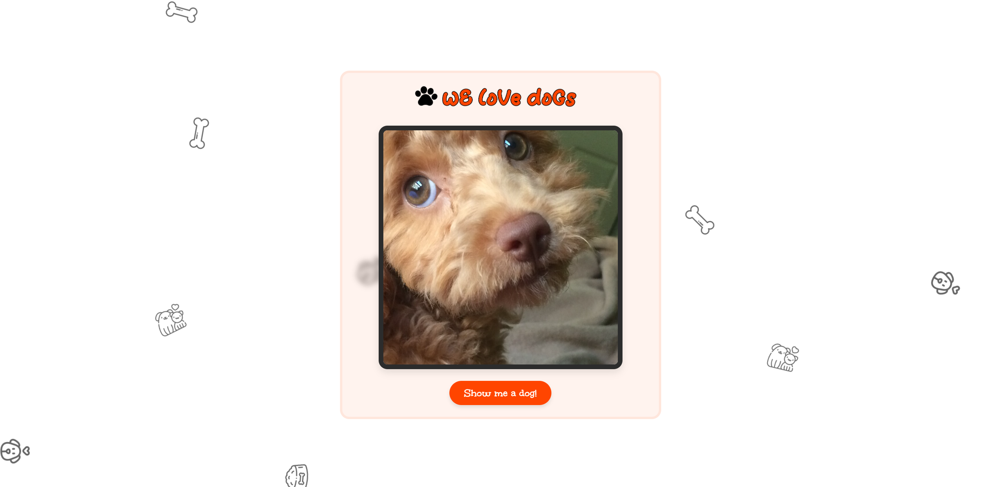
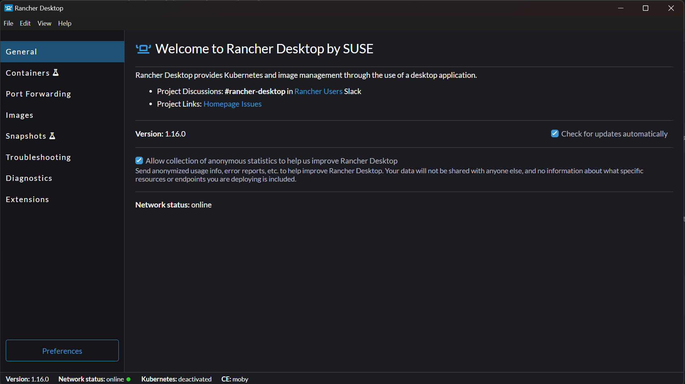
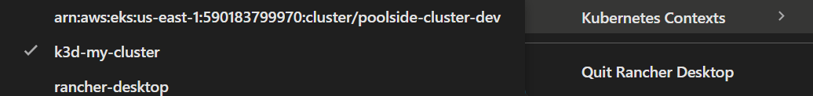

# Monitoring a Go Application with Prometheus and Grafana (wE loVe doGs)

This repository provides a simple Go-based server that serves random dog images through an API endpoint and demonstrates how to monitor key metrics (API response times, button presses, error rates) using Prometheus and Grafana.


---

## Table of Contents

- [Prerequisites](#prerequisites)
- [Installation Steps](#installation-steps)
  - [Install Rancher](#install-rancher)
  - [Install K3d](#install-k3d)
  - [Install Helm](#install-helm)
- [Running the Application](#running-the-application)
- [Testing the Monitoring Setup](#testing-the-monitoring-setup)

---

## Prerequisites

- Basic understanding of Docker, Kubernetes and Helm
- WSL2 for Windows users
- Access to Rancher (Docker runtime)
- Access to a K3d (Local kubernetes environment)
- Terraform (Optional)
- Digital Ocean Account (Optional)

---

## Installation Steps

### Install Rancher

1. **Follow installation guide**:
   ```
   https://docs.rancherdesktop.io/getting-started/installation 
   ```

2. **Access Rancher**:
   - Open Rancher desktop application.
   


### Install K3d

1. **Install K3d**:
   ```
   https://k3d.io/stable/#install-script
   ```

2. **Verify Installation**:
   ```bash
   k3d version
   ```

2. **Switch Kubernetes Context**:
   


### Install Helm

1. **Install Helm**:
   ```
   https://helm.sh/docs/intro/install/
   ```

2. **Verify Installation**:
   ```bash
   helm version
   ```

---

## Running the Application

1. **Start the Application**:
   - Run `sh ./deploy-stack.sh` and wait for the deployment to complete. 

      You'll see the following output:
      ```
      All pods are ready!
      Setting up port forwarding for Grafana and Prometheus...
      Forwarding from 127.0.0.1:3000 -> 3000
      Forwarding from 127.0.0.1:9090 -> 9090
      Forwarding from [::1]:3000 -> 3000
      Forwarding from [::1]:9090 -> 9090
      ```

2. **Access the Application**:
   - Open `http://localhost:9900/` in your browser.

3. **Access Grafana**:
   - Open `http://localhost:3000/` in your browser.
   - Use `admin` as the username and `prom-operator` as default password.
   - Navigate to dashboard and explore the metrics.

4. **Access Prometheus**:
   - Open `http://localhost:9090/` in your browser.
   - Navigate to `http://localhost:9090/query` and explore the metrics.

5. **Setup Cloud Deployment (Optional)**:
   - If you have Terraform installed, you can deploy the application to Digital Ocean. Create a tfvars file with 
   ```
      do_token = "your_digitalocean_api_token" # your token
      region   = "lon1"  
   ```
6. **Deploy to Digital Ocean**:
   - Run `terraform init`, `terraform plan`, and `terraform apply --auto-approve` to deploy the application to Digital Ocean.

7. **Cleaning Up**:
   - Run `k3d cluster delete my-cluster` to delete the local Kubernetes cluster.
   - Run `terraform destroy --auto-approve` to clean up cloud deployment (if any).
---

## Testing the Monitoring Setup

1. **Simulate API Requests**:
   - Click the "Show me a Dog!" button multiple times to simulate API requests.
   
2. **Check Metrics in Prometheus**:
   - Query for metrics like `button_press_total` to see request counts.

3. **Visualize in Grafana**:
   - Navigate to Dashboards in Grafana.
   - Import the "metrics-dashboard.json" dashboard file from the repository.
   - Repeat the process for "logs-dashboard.json".
   - Open "Key Metrics" from dashboards in Grafana.
   - Open "Live Logs" to see real-time logs.

---

Cheers! 🐶🚀
